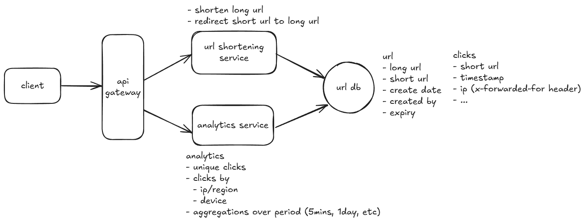
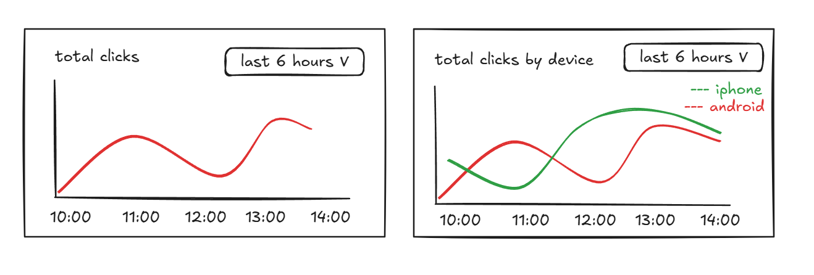

I'm building a TinyURL-like service completely from scratch to learn about system design. More specifically — to really learn how distributed systems work.

<!-- truncate -->

Why a URL shortener? 
Because it is deceptively simple to start but the complexity steadily grows as you add in more traffic and features like link expiry and analytics.

### My stack (for now)
**Backend**: Java (because I am most familiar with this) This will be used in the main url service which will have all the APIs for taking the long url and giving back the short url. It will be used in analytics service to query for metrics like click counts by time.

**Storage**: DynamoDB or Postgres (i am still deciding). This will store the long and short urls. I can keep the clicks in the same db but then the analytics performance might take a hit. But this is maybe too early for that. Maybe a timeseries database like InfluxDB is good for that. We'll see.

**Infra**: AWS. Nothing to speak here. I work on this at my job and I know AWS more than any other cloud providers.

**Frontend** To manage the short urls (create/update/delete/list) and to display the analytics.

## High Level Design

### Analytics
