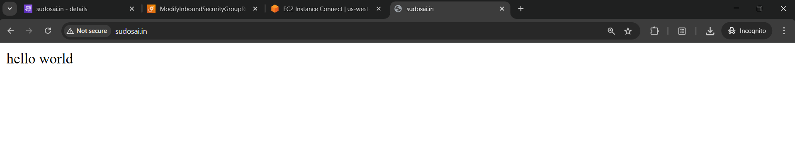

I already have a domain sudosai.in in godaddy which has been gathering dust for over a year now. I am going to use that to point to my app. Since I am somewhat familiar with AWS so I am going to host my stuff there.

<!-- truncate -->

First, I changed the nameservers from godaddy to aws. I logged into my aws console and created a new hosted zone in route 53. It creates some NS record values. I updated godaddy’s dns nameservers with aws’s.


Second I created a throwaway EC2 instance (a machine in the ether) and copied its public IP. I created 2 more records in my hosted zone

- A record: http://sudosai.in →  EC2’s public IP
- CNAME: http://www.sudosai.in → sudosai.in

See the link there? This is what happens when I would type in http://www.sudosai.in in Google. The request goes to any one of my 4 aws dns nameservers. It then checks the CNAME. The CNAME www.sudosai.in points to sudosai.in and then the A record sudosai.in points to the public IP of the instance 35.92.42.85.

Ok, so the road is paved but I need to return something to the guy who goes to www.http://sudosai.in right? So I log into my EC2 instance and I start an Apache HTTP server on it. I replace the default apache webpage too with “hello world”

```bash
sudo yum install -y httpd
sudo systemctl start httpd
sudo systemctl enable httpd
echo "Hello World" | sudo tee /var/www/html/index.html
```

A final piece is left. My EC2 does not allow public internet’s traffic by default. So I go to its security group and edit the inbound traffic to allow that.


Now I go to [www.sudosai.in](http://www.sudosai.in) and I see this 🙂
